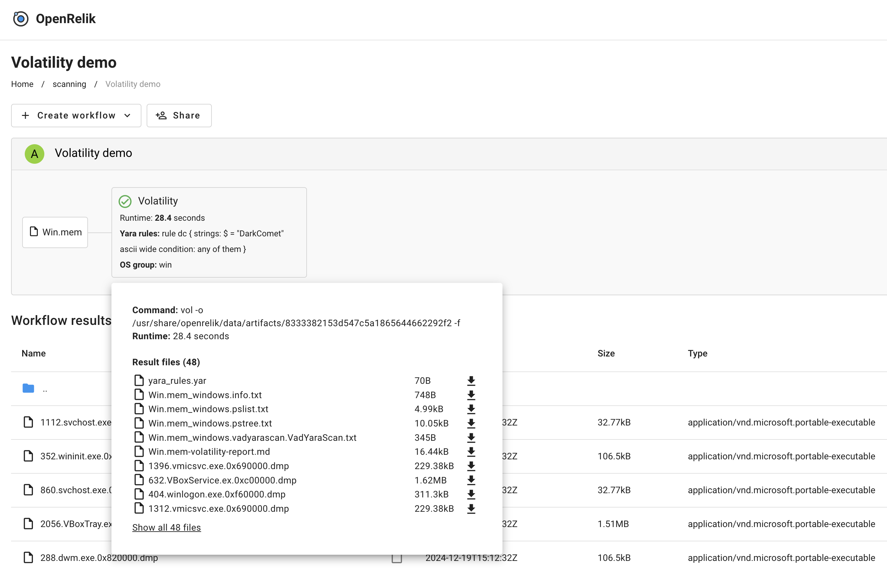

# Volatility OpenRelik worker

## Overview

This worker runs a couple of basic plugins on a memory dump using the Volatility
3 framework, and outputs the results to a new file in the same folder. Plugins
that dump files also dump results to the same folder.

## Global settings

- `Yara rules` (optional): Yara rules to pass on to the Yara scanner plugins.
- `OS group` (optional, defaults to `win`): OS group to run plugins on
  (win,lin,macos)
- `Output format` (optional, defaults to `txt`): Output format for the
  Volatility plugins.

## OS group supported plugins

### Windows

- `windows.info`
- `windows.pslist` - Will dump processes to the directory.
- `windows.pstree`
- `windows.vadyarascan.VadYaraScan` - Needs the `Yara rules` option to work.
